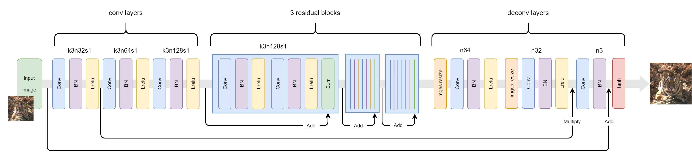
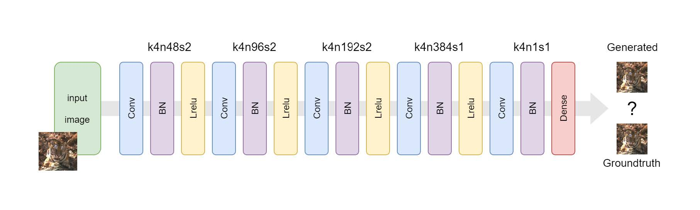
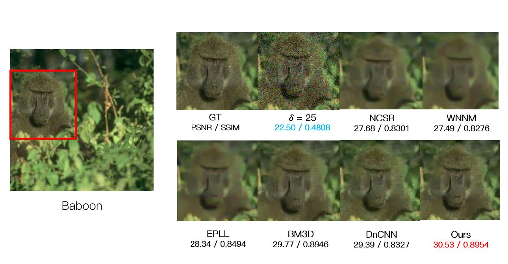
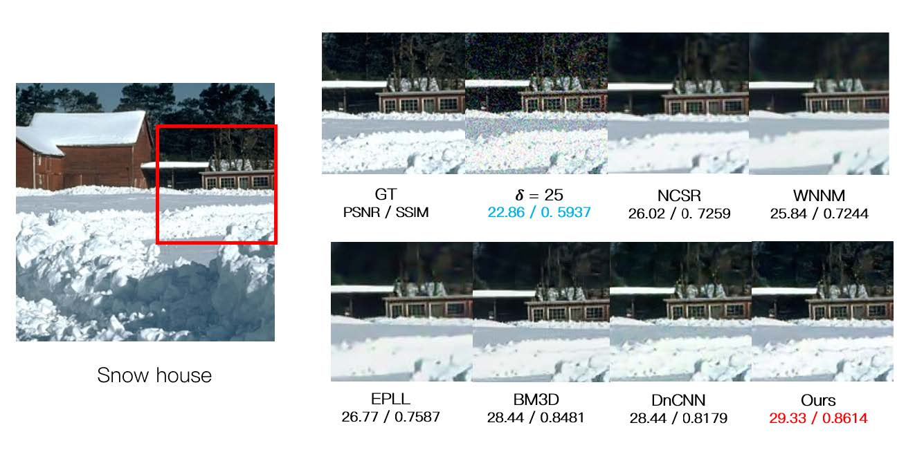
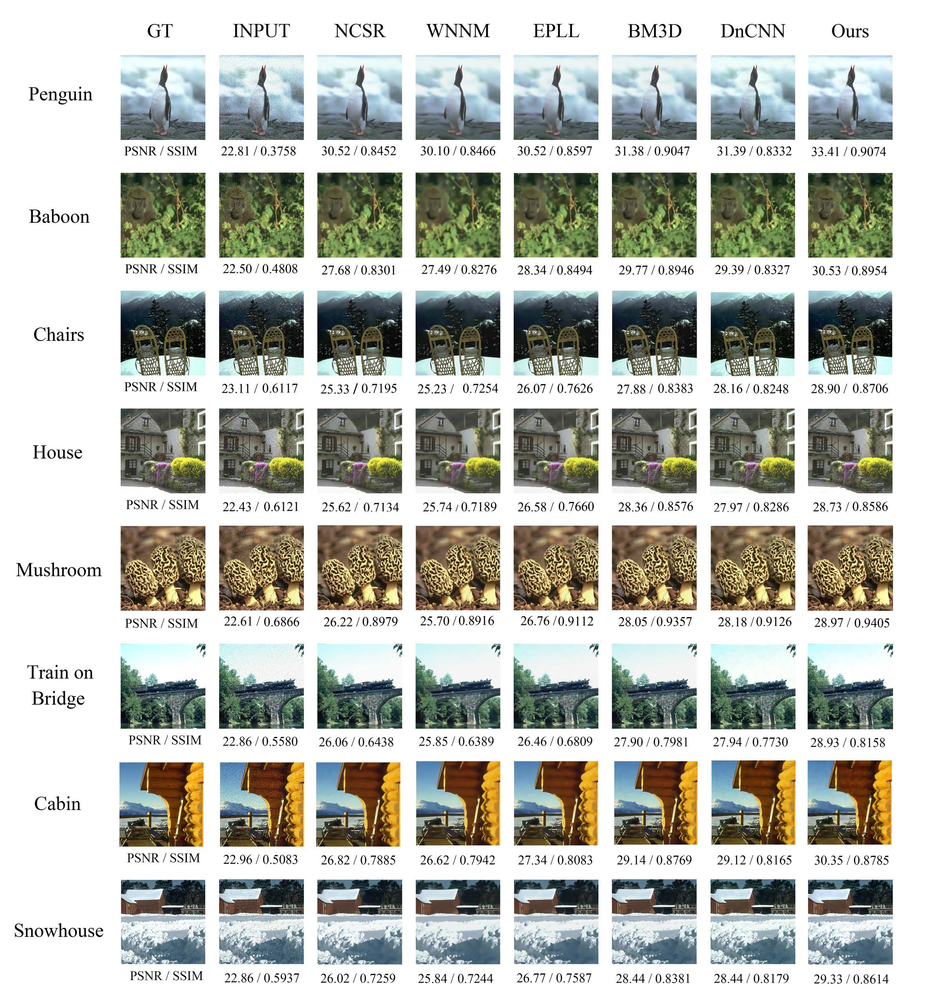

# 利用Wasserstein-GAN进行图像降噪


这是本人的本科毕业设计 ___基于生成对抗网络的图像降噪方法的研究___

本研究是基于此文章 [article](https://uofi.box.com/shared/static/s16nc93x8j6ctd0ercx9juf5mqmqx4bp.pdf) | [github](https://github.com/manumathewthomas/ImageDenoisingGAN)

收到本篇文章的启发 [github](https://github.com/iteapoy/GANDenoising)

其中基于Tensorflow2.0的代码受此文章启发 [github](https://github.com/huzixuan1/TF_2.0/tree/master/GAN)

感谢此篇文章总结的其他降噪方法 [github](https://github.com/wenbihan/reproducible-image-denoising-state-of-the-art)

## __生成网络:__



生成网络一共分为三部分:

- 卷积层 : 提取图像或噪声的特征
- 残差块: 试用“捷径”加速模型的训练, 解决梯度消失的问题
- 反卷积层: 上采样以得到生成的噪声


<center> 生成网络当中的图片流 </center>

## __判别网络:__



根据WGAN的原理, 将原本GAN最后一层的 ___sigmoid 层___ 变为 ___全连接层___  将问题转化为求解一个 __回归问题__

## __创新点:__

- 在生成网络当中加入 ___类自注意力机制___  的乘积通路
- 提升了生成网络的 ___损失函数___ 
- 利用Wasserstein-GAN的性质___增加了模型训练的稳定性___ 

## 结果:







<center>当噪声水平为25时本方法与其他方法的对比情况 </center>


<center>噪声水平为 15</center>


<center>噪声水平为 25</center>


<center>噪声水平为 50</center>

## __快速上手:__

#### 依赖环境:

- python == 3.8.10
- tensorflow == 2.3.0
- opencv  == 4.0.1
- scikit-image == 0.18.1
- numpy == 1.20.2
- pandas == 1.2.5

(可选但建议安装)

- cuda == 10.1
- cudnn == 7.6.5
- wget == 3.2 

```shell
# 推荐试用conda进行python环境配置
conda create -n wgan python=3.8
conda activate wgan
conda install cudatoolkit=10.1 cudnn=7.6.5 tensorflow==2.3.0 numpy opencv scikit-image pandas
```

#### 从Github 克隆代码

```shell
git https://github.com/juju-w/Image-Denoise-using-Wasserstein-GAN.git
cd Image-Denoise-using-Wasserstein-GAN
```

#### 建立你的数据集

```shell
# 用以下命令获取帮助
python image_operation.py -h

# 试用以下命令自动下载BSD500数据集生成数据
python image_operation.py \
		--dataset_build \
		--input_dir <INPUT_FOLDER> \
		--out_dir <OUT_FOLDER> 

# 你也可以试用以下命令生成自己的数据集
python image_operation.py \
		--add_noise --noise_levels 15 \
		--resize --size 256 \
		--input_dir INPUT_FOLDER \
		--out_dir <OUT_FOLDER>
```

####  根据需要更改配置文件  `config.py`

```python
"""
训练设置
"""
D_LEARNING_RATE = 0.0001	# Discriminater 学习率
G_LEARNING_RATE = 0.0001	# Generater 学习率
BATCH_SIZE = 64		# 批大小
PATCH_NUM = 128		# 每张图片生成的补丁数
PATCH_SHAPE = [BATCH_SIZE, 64, 64, 3]		# pathc size
BATCH_SHAPE = [BATCH_SIZE, 256, 256, 3]		# bathc size
N_EPOCHS = 20		# epoch num
SAVE_DIS_WEIGHT = False     # 选择是否保存判别器参数
# 损失参数
ADVERSARIAL_LOSS_FACTOR = 1.0
PIXEL_LOSS_FACTOR = 0.001
STYLE_LOSS_FACTOR = 0
SP_LOSS_FACTOR = 0.5
SMOOTH_LOSS_FACTOR = 0
SSIM_FACTOR = - 20.0
PSNR_FACTOR = - 2.0
D_LOSS_FACTOR = 1.0
# 各种路径设定
TRAIN_CLEAN_PATH = 'data/output/1_train/clean/'
TRAIN_NOISE_PATH = 'data/output/1_train/noise15/'
VAL_CLEAN_PATH = 'data/output/2_val/clean/'
VAL_NOISE_PATH = 'data/output/2_val/noise15/'
TEST_CLEAN_PATH = 'data/output/3_test/clean/'
TEST_NOISE_PATH = 'data/output/3_test/noise15/'
CHECKPOINT_PATH = 'checkpoint/noise15/'
"""
测试设置
"""
GEN_IMG_PATH = 'output/WGAN/fake_noise15'	#测试图片保存位置
GEN_CSV = True		# 是否在测试结束之后生成CSV文件

```

#### 运行

```shell
# 训练
python train.py

# 测试
python test.py
```

#### 评价指标

能在以下目录找到csv文件 `GEN_IMG_PATH.csv` 默认保存在 `output/WGAN/fake_noise15.csv`

## 引用

如果你在你的研究当中用到了此篇文章的方法,请考虑加入以下 BibTeX 信息.

```
@misc{juju-w2021WGAN,
  author = {juju-w},
  title = {Image-Denoise-using-Wasserstein-GAN},
  year = {2021},
  howpublished = {\url{https://github.com/juju-w/Image-Denoise-using-Wasserstein-GAN}}
}
```

